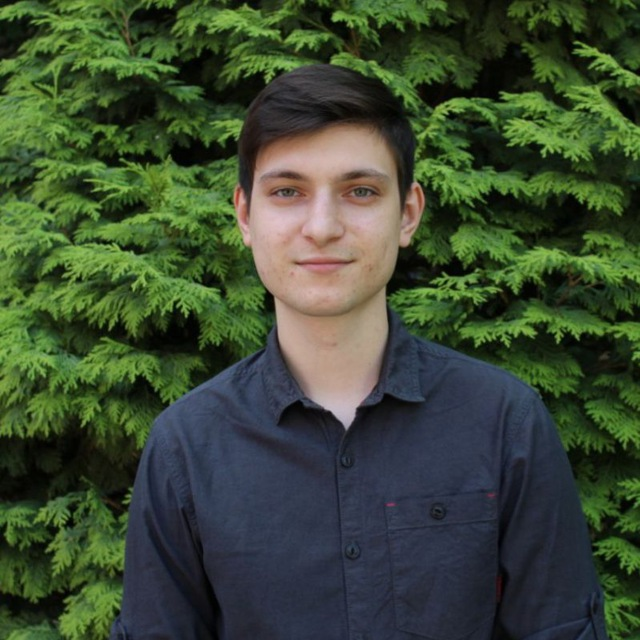

# Обо мне

### __Гордеев Иван Дмитриевич__
_Я являюсь програмистом среднего уровня с широким сперкторм познаний. Я готов учиться, развивться и браться за самые амбициозные и интересные пороекты._

__Образование:__
- *Высшее. ИАиС ВолгГТУ 2018-2022(Информационные системы и технологии)*
- _Нетология. Python-bachend разработчик(04.2024 - н.в.)_

__Место работы:__
- _АО "Хлебозавод №5". Инженер-программист(01.2022 - н.в.)_

__Навыки__

- _1С:Предприятие_
- _С++_
- _С#_
- _Qt_
- _Python_
- _Git_

__Текущие проекты__
- *Telegram бот(следите за новостями)*